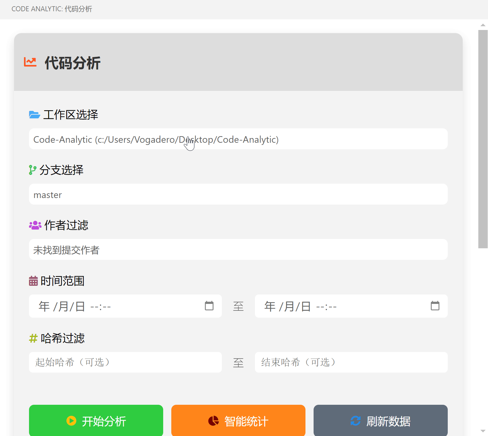
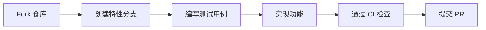

# Code Analytic 🕵️

[](https://code.visualstudio.com/)
[](https://marketplace.visualstudio.com/items?itemName=yourname.code-analytic)
[](https://marketplace.visualstudio.com/items?itemName=yourname.code-analytic)
[](LICENSE)
[](https://github.com/yourname/code-analytic/actions)

专业的代码分析工具，为开发者提供深度 Git 仓库洞察和可视化代码演进分析。直接在 VS Code 中查看项目的健康度和开发动态。



## ✨ 核心功能

### 🔍 多维代码分析
- **多仓库支持**：同时监控多个 Git 仓库
- **提交历史分析**：交互式时间轴展示代码演进
- **智能统计**：实时生成代码变更热力图
- **开发者洞察**：个人/团队贡献度分析

### 🎛️ 高级功能
```text
📈 代码增量分析 (LOC/Day)
🧩 模块耦合度检测
📊 文件变更频率热图
🔗 提交链追溯分析
```

### ⚙️ 技术特性

```diff
+ 支持 Git 2.0+ 版本
+ 自动适配 VS Code 主题
+ 零配置开箱即用
- 不收集任何用户数据
```

## 🚀 快速开始

### 安装方式

**市场安装**：

1. 打开 VS Code 扩展面板
2. 搜索 "Code Analytic"
3. 点击安装按钮

**手动安装**：

```bash
git clone https://github.com/yourname/code-analytic.git
cd code-analytic
npm install
vsce package
code --install-extension code-analytic-0.1.0.vsix
```

## 🖥️ 使用指南

1. **打开分析面板**

   ```javascript
   // 命令面板执行
   Ctrl+Shift+P → "Show Code Analysis"
   ```

2. **选择工作区** 

3. **分析维度配置**

   | 参数     | 类型        | 默认值     | 说明                 |
   | :------- | :---------- | :--------- | :------------------- |
   | 时间范围 | DateRange   | 最近30天   | 支持自然语言输入     |
   | 分支     | MultiSelect | 当前分支   | 多分支对比分析       |
   | 作者     | String[]    | 全部开发者 | GitHub/GitLab 用户名 |

4. **查看智能报告**

   ```markdown
   - 每日提交频率曲线
   - 文件变更排行榜
   - 代码质量雷达图
   ```

## ⚙️ 配置选项

在 `settings.json` 中添加：

```json
{
  "codeAnalytic.timeFormat": "relative", // absolute/relative
  "codeAnalytic.ignoredFiles": ["package-lock.json"],
  "codeAnalytic.cacheStrategy": "smart", // none/smart/aggressive
  "codeAnalytic.theme": "vscode", // github/gitlab/jira
}
```

## 🛠️ 开发贡献

### 环境要求

```yaml
node: 18.x
vscode: ^1.85.0
npm: 9.x
```

### 开发流程



### 测试规范

```bash
# 运行单元测试
npm test:unit

# 集成测试
npm test:integration

# E2E 测试
npm run test:e2e
```

## 📜 许可证

MIT License © 2024 [Vogadero]

## 🤝 贡献指南

我们欢迎各种形式的贡献！请阅读：

- [行为准则](vscode-webview://0khkdn2j8525463bq40sgktn2gqlie9imkvuhie6p6fkhsp7guor/CODE_OF_CONDUCT.md)
- [问题模板](vscode-webview://0khkdn2j8525463bq40sgktn2gqlie9imkvuhie6p6fkhsp7guor/.github/ISSUE_TEMPLATE)
- [PR 指南](vscode-webview://0khkdn2j8525463bq40sgktn2gqlie9imkvuhie6p6fkhsp7guor/docs/CONTRIBUTING.md)

------

> 🌟 **专业提示**：结合 [GitLens](https://marketplace.visualstudio.com/items?itemName=eamodio.gitlens) 使用可获得完整代码历史体验！